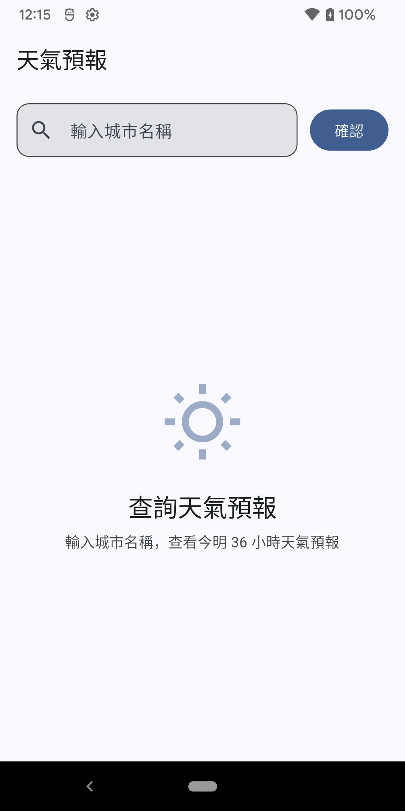
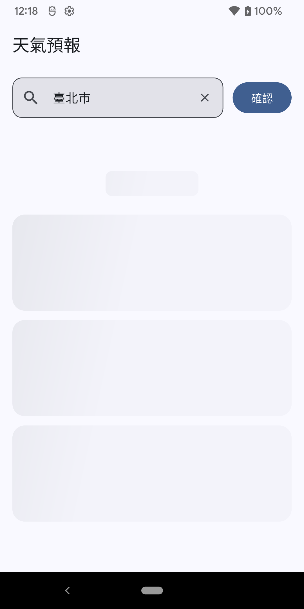
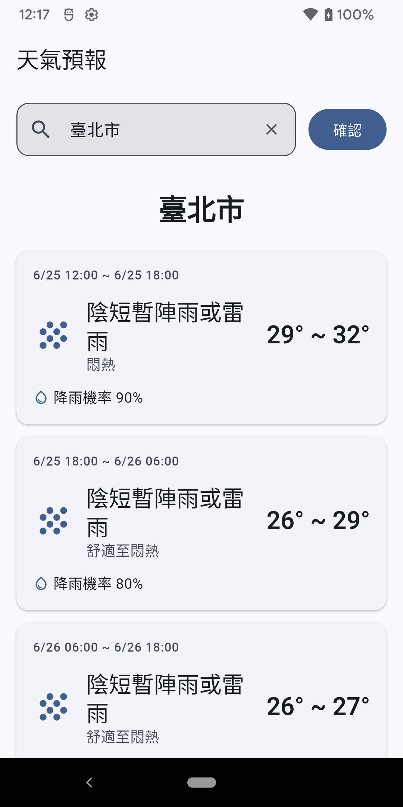
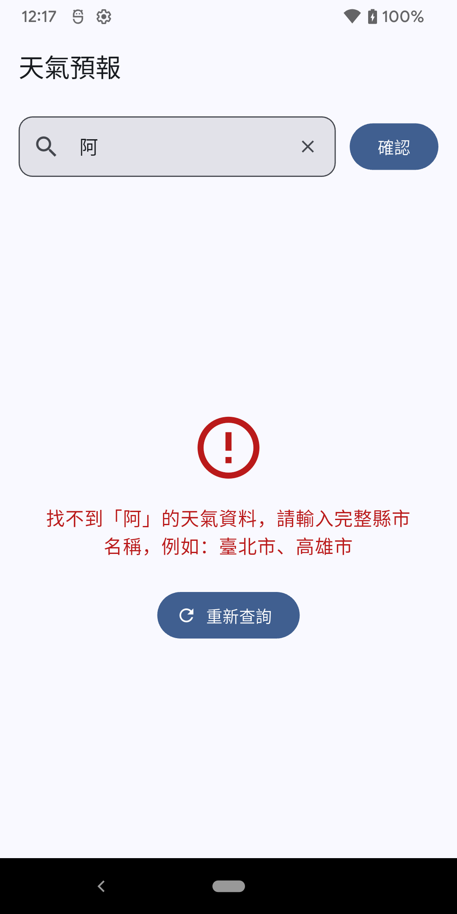

# 天氣預報 App

串接中央氣象署開放資料 API，查詢台灣各縣市今明 36 小時天氣預報。

## 截圖

| 初始畫面 | 讀取中（骨架屏） | 查詢結果 | 錯誤處理 |
|---------|----------------|---------|---------|
|  |  |  |  |

## 功能

- 輸入城市名稱查詢今明 36 小時天氣預報（天氣現象、溫度、降雨機率、舒適度）
- Autocomplete 輸入建議，支援「台北」→「臺北市」自動對應
- 四個獨立畫面狀態：初始提示、骨架屏 Loading、氣象資料卡片、錯誤訊息 + 重試
- 錯誤處理涵蓋：空白輸入、查無城市、網路逾時、斷線、伺服器錯誤、回傳格式異常

## 專案結構

```
lib/
├── main.dart
├── core/
│   ├── constants/
│   │   ├── api_constants.dart          # API 端點與 Key
│   │   └── location_names.dart         # 22 縣市名稱列表
│   ├── network/
│   │   └── dio_client.dart             # Dio 設定
│   └── theme/
│       └── app_theme.dart              # Material 3 主題
└── features/weather/
    ├── data/
    │   ├── models/
    │   │   └── weather_model.dart      # API 回應模型（freezed）
    │   └── repositories/
    │       └── weather_repository.dart  # API 呼叫 + 錯誤處理
    ├── domain/
    │   └── weather_state.dart           # 四種狀態定義（sealed class）
    └── presentation/
        ├── providers/
        │   └── weather_provider.dart    # Riverpod Notifier
        ├── pages/
        │   └── weather_page.dart        # 主頁面
        └── widgets/
            ├── initial_view.dart
            ├── loading_view.dart        # Shimmer 骨架屏
            ├── info_view.dart           # 天氣資料卡片
            └── error_view.dart
```

## 使用技術

- **Flutter 3.44** / Dart 3.12
- **flutter_riverpod** — 狀態管理（Notifier）
- **dio** — HTTP 請求
- **freezed** + **json_serializable** — 資料模型 code generation
- **shimmer** — Loading 骨架屏效果

## 建置與執行

```bash
# 安裝套件
flutter pub get

# 執行（Android 或 iOS）
flutter run

# 若有修改 model，重新產生 freezed 程式碼
dart run build_runner build
```

## API 來源

- [中央氣象署開放資料平台](https://opendata.cwa.gov.tw/)
- 端點：`/v1/rest/datastore/F-C0032-001`（一般天氣預報 — 今明 36 小時天氣預報）
- [API 使用說明參考](https://pjchender.dev/react-bootcamp/docs/book/ch5/5-1/)
